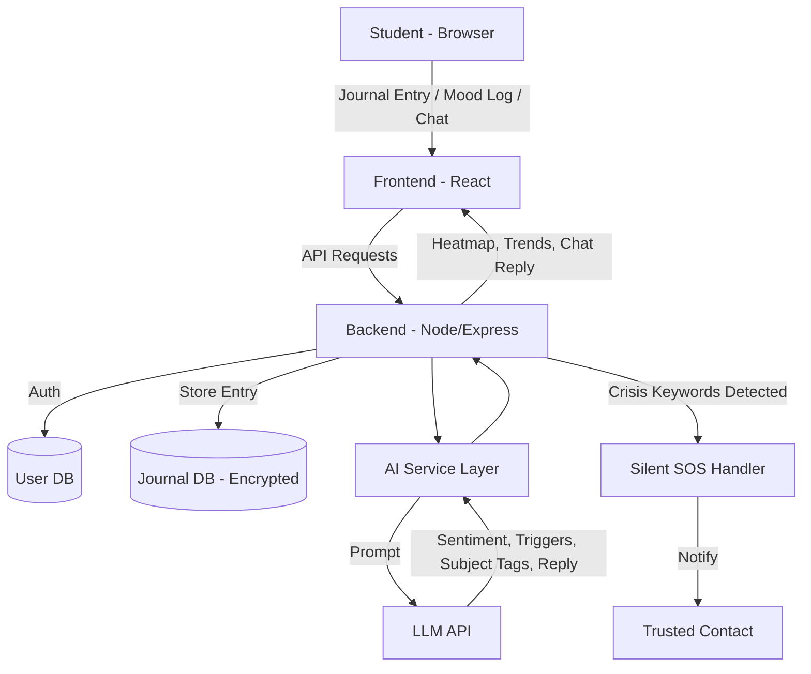
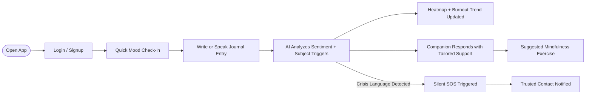

<div align="center">

# 🧠 MannMitra
### *Feel Better. Perform Better.*
### *A Friend for Every Thought*

An AI-powered mental wellness companion for NEET, JEE, CUET, CAT, GATE & UPSC aspirants.

Built for **PromptWars** — Google for Developers × H2S × Build with AI

</div>


## Problem Statement

Students preparing for India's most competitive entrance exams face severe stress, burnout, and self-doubt, but standard mood trackers don't catch *why*. MannMitra uses generative AI to read open-ended daily journal entries and mood logs, surface the hidden stress triggers and emotional patterns a basic tracker would miss, and respond with hyper-personalized coping strategies, adaptive mindfulness exercises, and motivational support — acting as an always-available companion throughout the exam journey.

## About MannMitra

MannMitra isn't a mood-slider-plus-chatbot app. It's built around three ideas most wellness trackers skip:

- Students think and feel in their own language, not just English — so MannMitra journals in it too.
- Stress usually has a *subject* — a chapter, a mock test, a specific paper — and surfacing that pattern is more useful than a generic "you seem anxious."
- Support should be proactive. Catching a downward trend across two weeks matters more than reacting to one bad day.

## Key Features

🌐 **Vernacular Journaling** — Type or speak journal entries in Hindi, Tamil, Telugu, Bengali, and more. Sentiment and stress-trigger analysis runs in the student's own language.

🔥 **Subject-Level Stress Heatmap** — Surfaces which subjects, chapters, or mock tests correlate with stress spikes over time, instead of a single flat mood score.

📉 **Burnout Trajectory Prediction** — Looks at trends across recent entries to flag rising burnout risk early, rather than only reacting after a crash.

🆘 **Silent SOS** — A discreet, one-tap escalation to a trusted contact when crisis language is detected or manually triggered — no typing required in a moment of crisis.

💬 **AI Companion Chat** — A warm, senior-like persona that adapts its tone and suggested coping exercise to the *type* of stress detected (exam anxiety, sleep deprivation, family pressure, comparison stress).

🧘 **Adaptive Mindfulness Library** — Exercises tagged by stress type and pulled in contextually rather than shown as a generic static list.

## Screenshots

> Replace these placeholders with real screenshots once the app is built. Save images in a `/screenshots` folder in the repo root and reference them like below.

| Home / Check-in | Journal | Dashboard |
|---|---|---|
| `` | `` | `` |

| Companion Chat | Stress Heatmap | Silent SOS |
|---|---|---|
| `` | `` | `` |

## System Architecture



## User Workflow



## Tech Stack

> Fill this in to match what was actually scaffolded — update after the build.

| Layer | Technology |
|---|---|
| Frontend | React (Vite) |
| Backend | Node.js + Express |
| Database | MongoDB / PostgreSQL *(confirm)* |
| AI Layer | LLM API (e.g., Claude) via an isolated service module |
| Auth | JWT (access + refresh tokens) |
| Config | JSON files for exam list, mindfulness library, supported languages |

## Security

- Journal entries encrypted at rest (AES-256)
- Passwords hashed with bcrypt
- JWT auth with refresh token rotation
- Input validation and sanitization on all endpoints
- Rate limiting on AI/chat routes
- Secrets stored only in environment variables, never committed
- Crisis-flagged content never logged in plaintext

## Accessibility

- WCAG 2.1 AA color contrast
- Full keyboard navigation and ARIA labels
- Voice input/output for journaling
- Adjustable font size
- Lightweight mode for low-bandwidth connections

## Getting Started

```bash
# Clone the repo
git clone https://github.com/<your-username>/mannmitra.git
cd mannmitra

# Install dependencies
npm install

# Set up environment variables
cp .env.example .env
# Fill in: DATABASE_URL, JWT_SECRET, AI_API_KEY

# Run locally
npm run dev
```


## Testing

```bash
npm test
```

Covers authentication, journal CRUD, and the chat endpoint, with the AI API mocked so tests don't depend on live calls.

## Future Scope

- Mentor/counselor dashboard with student consent
- Peer support circles (anonymized)
- Integration with study schedule for stress-aware revision planning
- Offline-first mobile app for low-connectivity areas

## Team

| Name | Role |
|---|---|
| *Your Name* | *Role* |
| *Teammate* | *Role* |

## Acknowledgments

Built for **PromptWars (In-person)** — organized by Google for Developers, H2S, and Build with AI.
